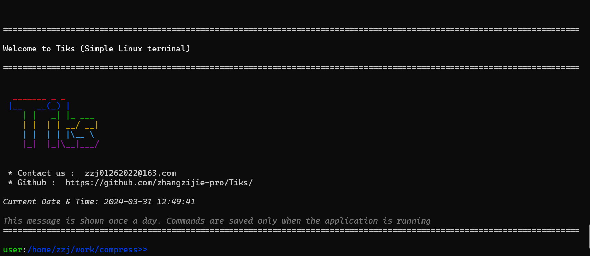

## Tiks - 简易 Linux 终端命令行工具

欢迎使用 Tiks，一个简易的 Linux 终端命令行工具，类似于常见的 Linux 终端环境，提供了一系列常用的命令和功能。
#### 供参考，若有错误改进地方可push到main



## 功能特点

- 提供常用的 Linux 命令，如 `pwd`, `ls`, `cd`, `rm`, `touch`, `cat`, `python` 等。
- 支持安装和更新软件包，通过 `apt` 命令进行操作。
- 提供历史命令查看功能，通过 `history` 命令进行查看。
- 支持文件和目录的重命名，通过 `rn` 命令进行操作。
- 支持文件和目录的移动，通过 `mv` 命令进行操作。
- 提供文件压缩和解压功能，通过 `tar` 命令进行操作。
- 支持退出当前进程，通过 `exit` 命令进行操作。

## 使用方法

Tiks 提供了类似于常见 Linux 终端的使用方法，下面是一些常用命令的示例：

```bash
Usage: <command> [options] [arg]

Commands:
    pwd         查看当前目录
    ls          查看当前目录下的所有文件
    cd          切换目录
    rm          删除文件或目录
    touch       创建新文件
    cat         查看文件内容
    python      运行 Python 代码
    html        打开 HTML 文件
    apt -i      安装软件包
    apt -update 更新软件包版本
    history     查看历史命令
    rn          重命名文件或目录
    mv          移动文件或目录
    tar -zxvf:  解压缩文件
    tar -xvf:   压缩文件
    exit        退出当前进程
```

## 贡献

如果你希望贡献代码或改进本项目，请先进行以下操作：

1. Fork 本项目
2. 在你的本地克隆项目：\`git clone https://github.com/zhangzijie-pro/compress.git\`
3. 进入项目目录：\`cd 项目名称\`
4. 运行代码：\`cargo run\`

请确保你已经安装了 Rust 编程语言以及 Cargo 包管理器。

5. 在你的本地进行修改、添加新功能或修复错误
6. 将修改推送到你的 GitHub 仓库：\`git push origin master\`
7. 创建一个 Pull 请求，向本项目的 \`master\` 分支提交你的修改

## 联系我们

如果您有任何问题或建议，请提交问题或发送电子邮件至zzj01262022@163.com。

感谢您使用我们的服务!

## 许可证

本项目使用 [MIT 许可证](LICENSE)。
